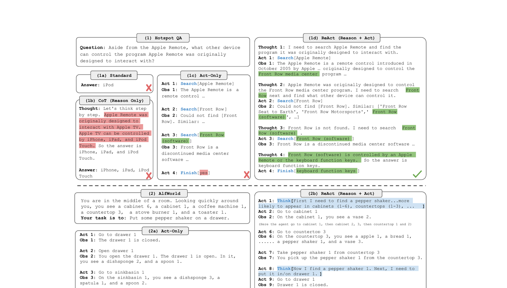

# 01 — Einführung in KI-Agenten

🇩🇪 **Deutsch** (diese Seite) · 🇬🇧 [English](../en/01-intro-to-ai-agents.md)

## Teil 1 — Theorie

### Konzept

Ein **KI-Agent** ist ein LLM, dem drei Dinge gegeben werden, die ein reiner Chatbot nicht hat:
1. Eine **Rolle/ein Ziel** — eine konkrete Aufgabe, nicht "beantworte irgendetwas"
2. **Tools** — Möglichkeiten, auf die Welt einzuwirken (das Web durchsuchen, eine API aufrufen, eine Datei lesen) über reine Texterzeugung hinaus
3. **Autonomie über eine Aufgabe** — er entscheidet *wie* er seine Tools einsetzt, um sein Ziel zu erreichen, statt einem festen Skript zu folgen

Ein einzelner LLM-Aufruf beantwortet einen Prompt. Ein Agent kann mehrere Schritte ausführen: nachdenken, ein Tool aufrufen, das Ergebnis betrachten, entscheiden, was als Nächstes zu tun ist, wiederholen bis fertig.

### Originalarbeit

Die formale Definition eines rationalen Agenten (nimmt seine Umgebung über Sensoren wahr, handelt über Aktoren, wählt Handlungen, die das Leistungsmaß maximieren) geht auf das Standard-Lehrbuch der KI zurück:

> Russell, S., & Norvig, P. (2020). *Artificial Intelligence: A Modern Approach* (4. Aufl.), Kapitel 2: Intelligent Agents. Pearson.

Die "Denken, Handeln, Beobachten, Wiederholen"-Schleife, die CrewAI implementiert, ist exakt das Muster, das für LLMs formalisiert wurde in:

> Yao, S., Zhao, J., Yu, D., Du, N., Shafran, I., Narasimhan, K., & Cao, Y. (2023). *ReAct: Synergizing Reasoning and Acting in Language Models*. ICLR 2023. [arXiv:2210.03629](https://arxiv.org/abs/2210.03629)


*Abbildung 1 aus Yao et al. (2023) — Vergleich von Standard-Prompting, reinem Reasoning (Chain-of-Thought), reinem Acting und ReActs verschränktem Reasoning+Acting auf zwei Aufgaben (HotpotQA, AlfWorld). Aus dem Paper für die Bildungsnutzung in diesem Kurs wiedergegeben.*

Das ist genau die Schleife, die ihr den `researcher`-Agenten in der Übung unten ausführen seht: ein `Thought` (Reasoning), ein `Act` (Tool-Aufruf), eine `Obs` (Beobachtung), wiederholt, bis der Agent entscheidet, dass er fertig ist.

## Teil 2 — Praxis

### In diesem Repo

Öffnet [src/research_crew/crew.py](../../src/research_crew/crew.py). Der `researcher`-Agent ([crew.py:17-23](../../src/research_crew/crew.py#L17-L23)) ist ein vollständiges Minimalbeispiel:

```python
@agent
def researcher(self) -> Agent:
    return Agent(
        config=self.agents_config['researcher'],
        verbose=True,
        tools=[SerperDevTool()]
    )
```

- Seine **Rolle/Ziel/Backstory** stammen aus [config/agents.yaml](../../src/research_crew/config/agents.yaml) — lest diese Datei. Beachtet, dass `{topic}` ein Platzhalter ist, der zur Laufzeit gefüllt wird.
- Sein **Tool** ist `SerperDevTool()` — ohne es könnte der Agent nur Wissen nutzen, das beim Training in das LLM eingebacken wurde; damit kann der Agent das aktuelle Web durchsuchen.
- Seine **Autonomie**: niemand sagt ihm, welche Suchanfragen er stellen soll. Anhand der Aufgabenbeschreibung entscheidet er selbst.

Führt die Crew aus (mit bereits gesetztem `verbose=True`) und beobachtet das Terminal (oder die Streamlit-Demo) — ihr seht, wie der Researcher-Agent nachdenkt, eine Suchanfrage wählt, Ergebnisse liest und entscheidet, ob er genug Informationen hat.

### Aufgabe

1. Führt die Crew aus (`uv run research_crew`) mit einem Thema eurer Wahl (ändert `inputs` in [main.py](../../src/research_crew/main.py)).
2. Lest die ausführliche Terminal-Ausgabe. Identifiziert den genauen Moment, in dem sich der Agent entscheidet, sein Tool aufzurufen, und den Moment, in dem er entscheidet, dass die Recherche abgeschlossen ist.
3. Erklärt in eigenen Worten (ein paar Sätze, kein Code): Was wäre anders, wenn `researcher` überhaupt keine Tools hätte? Würde der Agent trotzdem etwas "tun", oder nur einmal Text erzeugen?

### Zusatzaufgabe

Entfernt vorübergehend `tools=[SerperDevTool()]` vom `researcher`-Agenten und führt die Crew erneut aus. Vergleicht Qualität/Genauigkeit des Reports mit einem Lauf, bei dem das Tool vorhanden ist. Setzt das Tool danach wieder ein.
