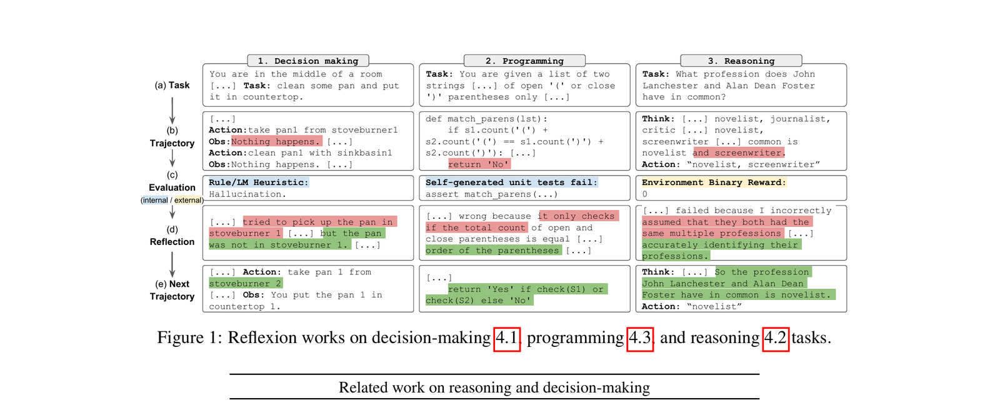

# 09 — Metakognition

🇩🇪 **Deutsch** (diese Seite) · 🇬🇧 [English](../en/09-metacognition.md)

## Teil 1 — Theorie

### Konzept

Metakognition bedeutet, dass ein Agent (oder das System um ihn herum) über seine eigene Ausgabe reflektiert und sie verbessert, statt einen ersten Entwurf als endgültig auszugeben. Zwei verbreitete Umsetzungen:
- Ein **Reviewer-Agent**, der die Ausgabe eines anderen Agenten kritisiert und zur Überarbeitung zurückgibt
- Eine **Selbstkritik-Schleife**, bei der derselbe Agent seine eigene Arbeit erneut liest und verbessert

Das unterscheidet sich von einem Guardrail (Übung 06): ein Guardrail blockiert/wiederholt basierend auf einer Bestehen/Nicht-bestehen-Prüfung, während es bei Metakognition um *Qualitätsverbesserung* durch Reflexion geht, nicht um Zugangskontrolle.

### Originalarbeit

Sprachliche Selbstreflexion — ein Agent kritisiert verbal seinen eigenen gescheiterten Versuch und speichert diese Kritik, um den nächsten Versuch zu informieren — wurde als Verstärkungssignal formalisiert, das überhaupt keine Aktualisierung der Modellgewichte benötigt:

> Shinn, N., Cassano, F., Berman, E., Gopinath, A., Narasimhan, K., & Yao, S. (2023). *Reflexion: Language Agents with Verbal Reinforcement Learning*. NeurIPS 2023. [arXiv:2303.11366](https://arxiv.org/abs/2303.11366)

*Abbildung 1 aus Shinn et al. (2023) — Reflexion über Entscheidungsfindungs-, Programmier- und Reasoning-Aufgaben: eine Trajektorie wird von einem Evaluator bewertet, eine verbale Selbstreflexion wird erzeugt und im Gedächtnis gespeichert, und die Trajektorie des nächsten Versuchs wird durch diese gespeicherte Reflexion bedingt. Aus dem Paper für die Bildungsnutzung in diesem Kurs wiedergegeben.*

Der `reviewer`-Agent, den ihr in der Übung unten baut, spielt die Rolle von Reflexions "Self-reflection"-Schritt, und seine Kritik über ein Guardrail zurückzuspeisen (die Zusatzaufgabe) ist genau die im Diagramm gezeigte Schleife "nächste Trajektorie wird von Reflexion beeinflusst".

## Teil 2 — Praxis

### In diesem Repo

Nichts hier tut das bisher — die Ausgabe von `analysis_task` geht direkt nach `output_file='output/report.md'`, ohne Überprüfungsschritt ([config/tasks.yaml](../../src/research_crew/config/tasks.yaml)). Das ist die Lücke für diese Übung.

### Aufgabe

1. Fügt einen dritten Task hinzu, `review_task`, zugewiesen an einen neuen `reviewer`-Agenten (oder nutzt `analyst` erneut), dessen Aufgabe es ist, den Report zu kritisieren: behandelt er das Thema vollständig, ist irgendetwas vage oder unbelegt, hat die Executive Summary wirklich die Länge einer Executive Summary?
2. Gebt `review_task` ein `context: - analysis_task`, damit er den Report erhält.
3. Entscheidet euch für eine Struktur der Kritik-Ausgabe: entweder (a) der Reviewer schreibt den Report direkt mit angewendeten Korrekturen neu, oder (b) der Reviewer erstellt eine Liste von Problemen, die ein Mensch (ihr) liest und über die ihr entscheidet, ob gehandelt wird. Implementiert eine davon.
4. Führt die gesamte Crew aus und lest die Kritik des Reviewers. War sie inhaltlich substanziell (hat eine echte Lücke entdeckt) oder generisch ("sieht gut aus!")? Falls generisch, überarbeitet `goal`/`backstory` des Reviewers in `agents.yaml`, um Konkretheit einzufordern, und vergleicht erneut.

### Zusatzaufgabe

Macht daraus eine echte Schleife statt einer einmaligen Überprüfung: wenn die Kritik des Reviewers konkrete Probleme enthält, speist sie diese zurück in ein Guardrail auf `analysis_task` (Übung 06), sodass der Analyst sie ansprechen muss, bevor die Crew den Task als abgeschlossen betrachtet. Das kombiniert Metakognition (die Kritik) mit Guardrails (die Durchsetzung) — beachtet, wie sich die beiden Patterns zusammensetzen lassen.
