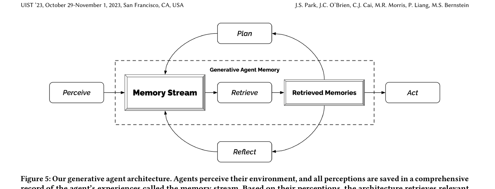

# 13 — Agenten-Gedächtnis

🇩🇪 **Deutsch** (diese Seite) · 🇬🇧 [English](../en/13-agent-memory.md)

## Teil 1 — Theorie

### Konzept

Gedächtnis (Memory) lässt einen Agenten Informationen *über* Läufe hinweg behalten (oder über Tasks innerhalb eines Laufs), statt jedes Mal bei null anzufangen. CrewAI unterscheidet mehrere Arten:
- **Kurzzeitgedächtnis** — aktueller Kontext innerhalb des laufenden Crew-Durchlaufs
- **Langzeitgedächtnis** — persistiert über separate Läufe hinweg (z. B. "wir haben dieses Thema letzte Woche schon recherchiert")
- **Entitätsgedächtnis** — Fakten über bestimmte Entitäten (Personen, Organisationen), denen die Crew begegnet ist

Das unterscheidet sich von RAG (Übung 05): RAG ruft aus von euch bereitgestellten Dokumenten ab; Memory ruft aus dem ab, was die *Crew selbst* zuvor gesagt oder gelernt hat.

### Originalarbeit

Die Architektur hinter "speichere alles, was passiert, reflektiere periodisch darüber, rufe relevante Teile ab, um zukünftiges Verhalten zu informieren" — was im Wesentlichen das ist, was CrewAIs Kurzzeit-/Langzeit-/Entitätsgedächtnis implementiert — wurde eingeführt in:

> Park, J. S., O'Brien, J., Cai, C. J., Morris, M. R., Liang, P., & Bernstein, M. S. (2023). *Generative Agents: Interactive Simulacra of Human Behavior*. Proceedings of the 36th Annual ACM Symposium on User Interface Software and Technology (UIST '23). [arXiv:2304.03442](https://arxiv.org/abs/2304.03442)


*Abbildung 3 aus Park et al. (2023) — die Architektur generativer Agenten: wahrgenommene Ereignisse fließen in einen Memory Stream, relevante Erinnerungen werden abgerufen, um Planning und Acting zu informieren, und die Ergebnisse fließen zurück in den Stream. Aus dem Paper für die Bildungsnutzung in diesem Kurs wiedergegeben.*

CrewAI implementiert den "Reflexions"-Schritt (viele Erinnerungen zu übergeordneten Einsichten synthetisieren) nicht so explizit wie dieses Paper, aber die Kernschleife — ins Gedächtnis schreiben, relevante Teile abrufen, sie die nächste Handlung beeinflussen lassen — ist dieselbe, die `memory=True` für diese Crew aktiviert.

## Teil 2 — Praxis

### In diesem Repo

Memory ist aktuell ausgeschaltet — als wir das Crew-Objekt früher in der Einrichtung dieses Projekts ausgegeben haben, zeigte es `memory=False`, `short_term_memory=None`, `long_term_memory=None`, `entity_memory=None`. Es einzuschalten ist eine Änderung von einer Zeile in [crew.py](../../src/research_crew/crew.py):

```python
return Crew(
    agents=self.agents,
    tasks=self.tasks,
    process=Process.sequential,
    verbose=True,
    memory=True,
)
```

Wie Knowledge-Quellen (Übung 05) embedded Memory den Inhalt ebenfalls im Hintergrund — also gilt dieselbe Gemini-Embedder-Falle. Übergebt `embedder` (in dieser Crew bereits konfiguriert), und es wird auch für Memory wiederverwendet.

### Aufgabe

1. Setzt `memory=True` bei der `Crew` und führt die Crew zweimal im selben Prozess für *dasselbe* Thema aus (z. B. über ein Skript, das `.kickoff()` zweimal aufruft, oder führt `uv run research_crew` zweimal ohne Neustart aus — beachtet, dass CrewAI-Memory auch zwischen CLI-Aufrufen auf lokalem Speicher persistiert, da es plattenbasiert ist).
2. Schaut in `~/.local/share/crewai` oder wo auch immer sich CrewAIs Memory-Speicherpfad auflöst (die CLI-/ausführlichen Logs zeigen das meist an) — sucht nach geschriebenen Memory-Dateien.
3. Führt die Crew zu einem Thema aus, das sich mit einem vorherigen überlappt (z. B. "Künstliche Intelligenz im Gesundheitswesen" und dann "Künstliche Intelligenz in der Arzneimittelforschung") und schaut, ob im ausführlichen Log irgendetwas zeigt, dass der Agent auf Memory aus dem früheren Lauf verweist.

### Zusatzaufgabe

Memory persistiert standardmäßig unbegrenzt — für eine Klasse, in der sich viele Studierende einen gemeinsamen Memory-Speicherpfad teilen (unwahrscheinlich bei separaten Codespaces, aber lokal möglich), könnte das Informationen zwischen Läufen durchlässig machen. Findet heraus, wie man CrewAI-Memory eingrenzt/zurücksetzt (Tipp: `crew.reset_memories()` oder das Löschen des Speicherverzeichnisses) und erklärt, wann ihr das in einer echten Unterrichtssituation tun würdet.
