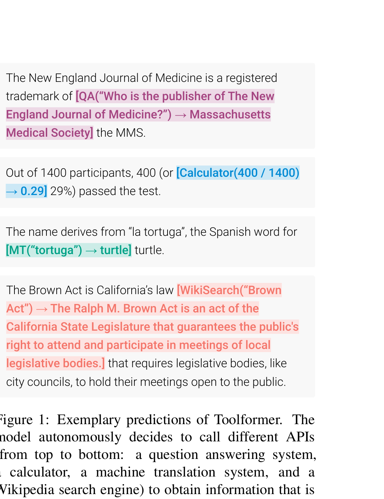

# 04 — Tool Use

🇬🇧 **English** (this page) · 🇩🇪 [Deutsch](../de/04-tool-use.md)

## Part 1 — Theory

### Concept

Tools turn an LLM from "generates plausible text" into "can actually do things": search the web, query a database, call an internal API, run code. The agent decides *when* and *with what arguments* to call a tool — you just need to describe the tool clearly enough that the LLM can use it correctly.

Every CrewAI tool needs:
- a **name** and **description** (this is what the agent reads to decide whether/how to use it — vague descriptions cause misuse)
- an **input schema** (a Pydantic model describing the arguments)
- a `_run()` method with the actual implementation

### Original paper

The idea that a language model can learn *when* to call a tool, *which* tool, and *what arguments* to pass — rather than a human hardcoding when tools fire — was demonstrated in:

> Schick, T., Dwivedi-Yu, J., Dessì, R., Raileanu, R., Lomeli, M., Zettlemoyer, L., Cancedda, N., & Scialom, T. (2023). *Toolformer: Language Models Can Teach Themselves to Use Tools*. [arXiv:2302.04761](https://arxiv.org/abs/2302.04761)


*Figure 1 from Schick et al. (2023) — Toolformer autonomously deciding to call different APIs (a question answering system, a calculator, a machine translation system, and a Wikipedia search engine) to obtain information it needs. Reproduced from the paper for educational use in this course.*

`SerperDevTool` in this crew plays the same role as the Wikipedia search API in the figure — the LLM decides on its own when a search is needed and writes the query, exactly like the `[WikiSearch(...)]` calls above.

## Part 2 — Practice

### In this repo

[src/research_crew/tools/custom_tool.py](../../src/research_crew/tools/custom_tool.py) is a template, not wired into the crew yet:

```python
class MyCustomTool(BaseTool):
    name: str = "Name of my tool"
    description: str = (
        "Clear description for what this tool is useful for, your agent will need this information to use it."
    )
    args_schema: Type[BaseModel] = MyCustomToolInput

    def _run(self, argument: str) -> str:
        return "this is an example of a tool output, ignore it and move along."
```

Compare it to the tool already in use, [crew.py:20](../../src/research_crew/crew.py#L20): `SerperDevTool()` — a fully pre-built tool from `crewai_tools`, requiring zero implementation, just an API key (`SERPER_API_KEY`).

The README's [tool category table](../../README.md#adding-more-tools-or-rag-for-students) lists ~90 pre-built tools split by whether they need just an API key (most search/scraping tools) or local embeddings (RAG-style tools, covered in exercise 05).

### Task

1. Implement `MyCustomTool` for real. Suggestions: a simple calculator (`eval`-free — parse and compute manually for safety), a tool that returns the current date/time, or a tool that counts words in a string.
2. Write a clear `name` and `description` — bad ones cause the agent to never call the tool, or call it with wrong arguments. Test both a vague description and a precise one; compare whether the agent uses the tool.
3. Add your tool to one of the agents in [crew.py](../../src/research_crew/crew.py) (`tools=[SerperDevTool(), MyCustomTool()]`) and craft a task description that should make the agent want to use it.

### Stretch goal

Swap `SerperDevTool` for one of the other pre-built search tools in the README's table (e.g. `TavilySearchTool`) and get it running with your own free API key from that provider.

---

**Team assignment:** this exercise unlocks [**Milestone M1: Tools**](assignment-milestones.md#m1-tools) of the [team assignment](assignment-overview.md).
