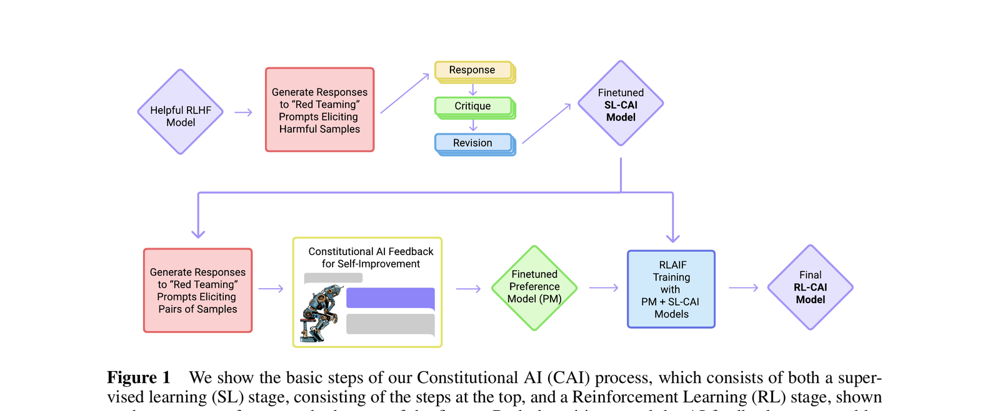

# 06 — Building Trustworthy Agents

🇬🇧 **English** (this page) · 🇩🇪 [Deutsch](../de/06-trustworthy-agents.md)

## Part 1 — Theory

### Concept

Agents fail in ways plain functions don't: they can produce confidently-wrong output, ignore instructions, or "succeed" while producing garbage. Trustworthiness mechanisms generally fall into two categories:
- **Guardrails** — validate a task's output *before* it's allowed to move to the next step, and optionally force a retry
- **Evaluation** — score output quality after the fact, for monitoring or grading rather than blocking

### Original paper

The general idea of using AI itself to check and revise AI output against a set of principles — rather than relying purely on human review — was demonstrated at scale in:

> Bai, Y., Kadavath, S., Kundu, S., Askell, A., Kernion, J., Jones, A., Chen, A., Goldie, A., Mirhoseini, A., McKinnon, C., et al. (2022). *Constitutional AI: Harmlessness from AI Feedback*. Anthropic. [arXiv:2212.08073](https://arxiv.org/abs/2212.08073)


*Figure 1 from Bai et al. (2022) — the Constitutional AI process: a supervised-learning stage (top, generate → critique → revise) followed by a reinforcement-learning stage (bottom, AI feedback trains a preference model used for RLAIF). Reproduced from the paper for educational use in this course.*

The `guardrail` you add in the exercise below is a much smaller-scale version of the same idea: a check that validates and can force revision of an agent's output before it's accepted, rather than trusting the first draft.

## Part 2 — Practice

### In this repo

CrewAI's `Task` supports a `guardrail` parameter — a function (or natural-language description) that validates output before the next task runs. Nothing in this repo uses it yet, which makes it a good exercise: right now, if the `researcher` agent returns a thin or off-topic result, `analysis_task` happily writes a report from bad input with no check in between.

For evaluation, `crewai_tools` ships a Patronus integration (`PatronusEvalTool`, `PatronusLocalEvaluatorTool`, `PatronusPredefinedCriteriaEvalTool` — see the README's tool table) for scoring agent output against criteria.

### Task

1. Add a `guardrail` to `research_task` in [crew.py](../../src/research_crew/crew.py) that checks the output isn't suspiciously short (e.g. fewer than 200 characters) and fails validation if so:
   ```python
   def research_quality_guardrail(output):
       if len(output.raw) < 200:
           return (False, "Research output too short — needs more detail")
       return (True, output.raw)

   @task
   def research_task(self) -> Task:
       return Task(
           config=self.tasks_config['research_task'],
           guardrail=research_quality_guardrail,
       )
   ```
2. Force a failure on purpose: temporarily break the `SERPER_API_KEY` (rename it) so the researcher gets no search results back, and confirm the guardrail catches the resulting thin output and triggers a retry instead of silently passing bad data to the analyst.
3. Restore the key, re-run, confirm the guardrail passes normal output through unchanged.

### Stretch goal

Read about `guardrail_max_retries` on `Task` (defaults to 3). Set it to 1 and explain what happens if the guardrail keeps failing — does the crew error out, or proceed anyway? Check the CrewAI source for the answer rather than guessing.
