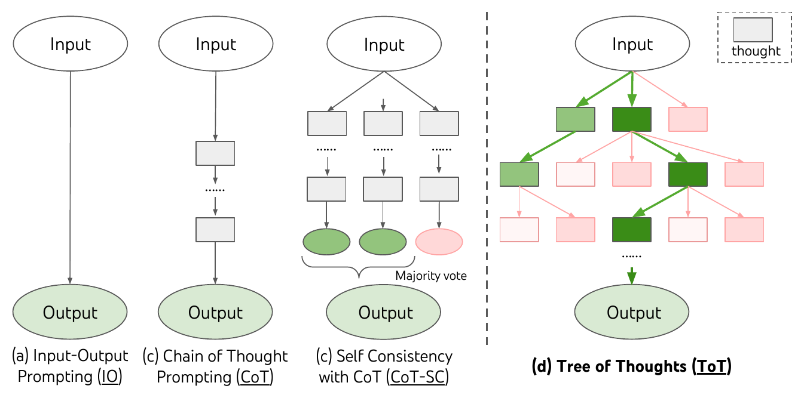

# 07 — Planning Pattern

🇬🇧 **English** (this page) · 🇩🇪 [Deutsch](../de/07-planning-pattern.md)

## Part 1 — Theory

### Concept

Instead of an agent improvising step-by-step, a **planner** first produces an explicit plan — a sequence of steps — before any task executes. This trades a bit of latency/cost up front for more predictable, reviewable execution: you can read the plan and catch a bad approach before the agent burns tool calls and tokens on it.

### Original paper

Planning-as-prompting was formalized as a deliberate search over multiple reasoning paths — instead of committing to one left-to-right chain of thought — in:

> Yao, S., Yu, D., Zhao, J., Shafran, I., Griffiths, T. L., Cao, Y., & Narasimhan, K. (2023). *Tree of Thoughts: Deliberate Problem Solving with Large Language Models*. [arXiv:2305.10601](https://arxiv.org/abs/2305.10601)


*Figure 1 from Yao et al. (2023) — comparing (a) standard input-output prompting, (b) Chain-of-Thought, (c) Self-Consistency with CoT (majority vote over several chains), and (d) Tree of Thoughts, which explores and can backtrack over a tree of intermediate "thoughts" before committing to an output. Reproduced from the paper for educational use in this course.*

CrewAI's `planning=True` doesn't build a full search tree like ToT — it's closer to (b), a single upfront plan — but it's solving the same underlying problem: don't commit to the first reasoning path the LLM produces without giving it a chance to consider the task structure first.

## Part 2 — Practice

### In this repo

CrewAI builds this in at the `Crew` level via two fields (`crew.py` doesn't use them yet):

```python
return Crew(
    agents=self.agents,
    tasks=self.tasks,
    process=Process.sequential,
    verbose=True,
    planning=True,
    planning_llm="gemini/gemini-2.5-flash",
)
```

When `planning=True`, CrewAI runs an internal `AgentPlanner` (using `planning_llm`) before execution starts, which adds a plan to each task's context.

### Task

1. Add `planning=True` and `planning_llm="gemini/gemini-2.5-flash"` to the `Crew` in [crew.py](../../src/research_crew/crew.py).
2. Re-run the crew with verbose output and find the planning step in the logs — it happens before `research_task` starts. Read the generated plan.
3. Compare two runs of the same topic, one with `planning=True` and one without. Does the plan visibly change *what* the researcher searches for, or just add overhead with no behavior change? Write down your observation — there's no single right answer, the point is to actually look.

### Stretch goal

Planning costs an extra LLM call before any task runs. For a 2-task crew like this one, is that overhead worth it? Argue both sides in a few sentences, then think about when a crew has enough tasks/agents that planning would clearly start paying for itself (hint: think about exercise 08's multi-agent crews).
