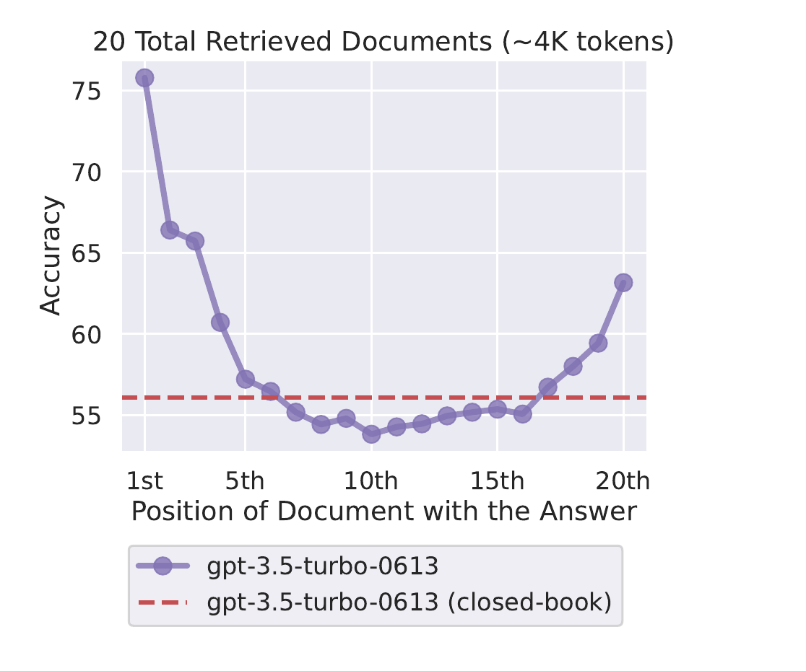

# 12 — Context Engineering

🇬🇧 **English** (this page) · 🇩🇪 [Deutsch](../de/12-context-engineering.md)

## Part 1 — Theory

### Concept

"Context engineering" is the practice of deliberately controlling what information ends up in an LLM's context window: what's included, what's excluded, and how it's structured — as opposed to just writing a long prompt and hoping for the best. For agents specifically, this includes: task descriptions, what prior task outputs get passed forward, what knowledge/memory gets retrieved, and how much of each.

This matters because context windows are finite and noisy — irrelevant information doesn't just cost tokens, it can actively distract the LLM from the relevant parts.

### Original paper

The empirical case for *why* what you put where in the context window matters — not just whether it's there at all — was made in:

> Liu, N. F., Lin, K., Hewitt, J., Paranjape, A., Bevilacqua, M., Petroni, F., & Liang, P. (2024). *Lost in the Middle: How Language Models Use Long Contexts*. Transactions of the Association for Computational Linguistics, 12, 157–173. [arXiv:2307.03172](https://arxiv.org/abs/2307.03172)

*Figure 1 from Liu et al. (2024) — accuracy on a multi-document QA task as a function of where the document containing the answer sits among 20 retrieved documents: highest at the first and last positions, lowest in the middle. Reproduced from the paper for educational use in this course.*

This is directly relevant to exercise 2 below: if you pass the analyst an enormous, unfiltered research output, the most useful facts in the *middle* of it are exactly the ones most likely to get ignored — regardless of how large Gemini's advertised context window is.

## Part 2 — Practice

### In this repo

Three context-engineering mechanisms are already in use, worth identifying explicitly:

1. **Templating** — `{topic}` placeholders in [config/agents.yaml](../../src/research_crew/config/agents.yaml) and [config/tasks.yaml](../../src/research_crew/config/tasks.yaml), substituted from `inputs` in [main.py](../../src/research_crew/main.py#L13-L15). This injects exactly the variable that matters (the topic) into every prompt, without you manually string-formatting anything.
2. **Selective context passing** — `analysis_task`'s `context: - research_task` field tells CrewAI to include `research_task`'s full output in the analyst's prompt. This is a deliberate choice: the analyst gets *only* the research output, not the researcher's intermediate tool calls or search queries.
3. **Role-scoped instructions** — each agent's `backstory` in `agents.yaml` shapes tone/behavior without needing to repeat instructions in every task description.

### Task

1. In [config/tasks.yaml](../../src/research_crew/config/tasks.yaml), the `analysis_task` description is long and itemized (5 numbered requirements). Rewrite it to be vague ("write a good report about {topic}") and re-run. Compare report quality/structure to the original. This demonstrates how much context-engineering work is happening in that task description, even though it's "just text."
2. `context: - research_task` passes the *entire* research output to the analyst. If `research_task`'s output were enormous (say, 50 search results summarized in full), what problem would that cause? Propose one fix (without necessarily implementing it) — e.g. asking the researcher to produce a tighter summary, or truncating.
3. Restore the original task description.

### Stretch goal

CrewAI tasks support an `output_pydantic` field to force structured (schema-validated) output instead of free text. Define a Pydantic model for the research output (e.g. `key_findings: list[str]`, `sources: list[str]`) and apply it to `research_task`. Does forcing structure change what the analyst receives via `context`, and does the final report change as a result?
